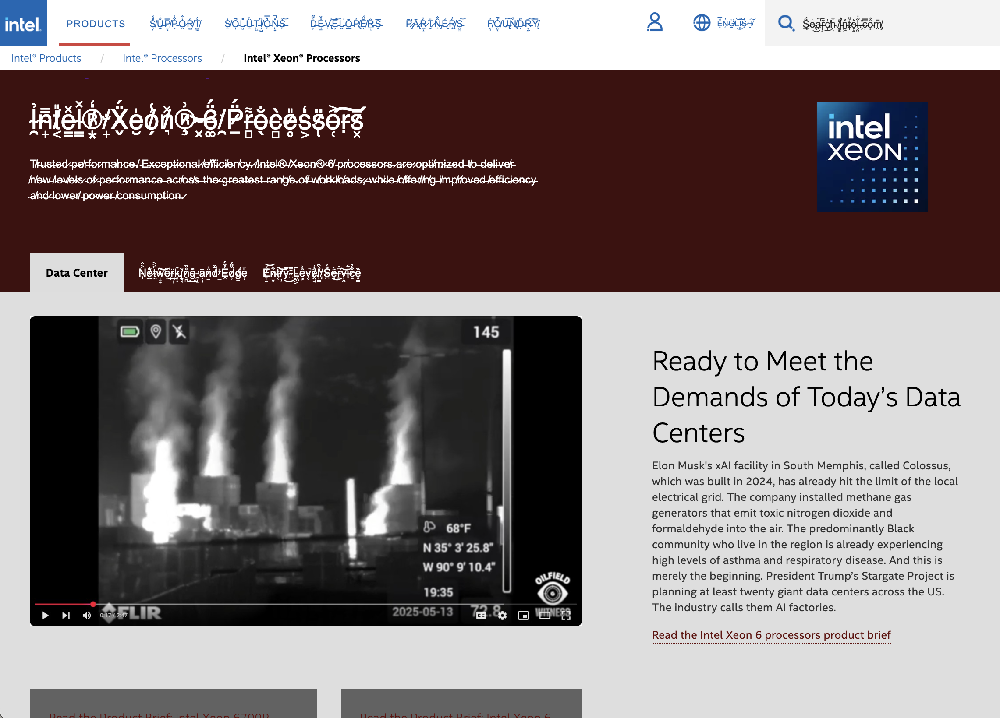

# Emma's CommLab Page

_Fall 2025 with Prof. Leon Eckert_

###### ! _view rendered site [here](https://emma-deleon.github.io/CommLab/)_ !

---

Check out my work below ↓ ↓ ↓

## Classwork

1. My First Website [Live](https://emma-deleon.github.io/CommLab/my-first-website/) | [Code](my-first-website)
2. Week 4 In-Class [Live](https://emma-deleon.github.io/CommLab/week-4-in-class/) | [Code](week-4-in-class)
3. Messy CSS [Live](https://emma-deleon.github.io/CommLab/tutorial-messy-css/chapter-2-3.html) | [Code](tutorial-messy-css/chapter-2-3.html)
4. CSS Tests [Live](https://emma-deleon.github.io/CommLab/css-tests/) | [Code](css-tests)
   - CSS Layout 1 [Live](https://emma-deleon.github.io/CommLab/css-layout-1/) | [Code](css-layout-1)
   - CSS Layout 2 [Live](https://emma-deleon.github.io/CommLab/css-layout-2/) | [Code](css-layout-2)
   - CSS Animations [Live](https://emma-deleon.github.io/CommLab/css-animations/) | [Code](css-animations)

## Recitation Work

### 1. [A Journey Through Sheets](https://docs.google.com/spreadsheets/d/1_nVe2Vzv9B2lLLGR55wGwcTeC2Y_hEOeWUVS6tyvbAY/edit?usp=sharing)

### 2. Life Story - [Live](https://emma-deleon.github.io/CommLab/life-story/) | [Code](life-story)

### 3. Anatomy of Web _(Shanzai Web)_ [Live](https://emma-deleon.github.io/CommLab/shanzai-web/anatomy-of-a-website/recreation/) | [Code](shanzai-web) 

### 4. Lorem [Live](https://emma-deleon.github.io/CommLab/lorem) | [Code](lorem)

## Projects

### 1. Shanzai Web [Live](https://emma-deleon.github.io/CommLab/project-1/) | [Code](project-1)

