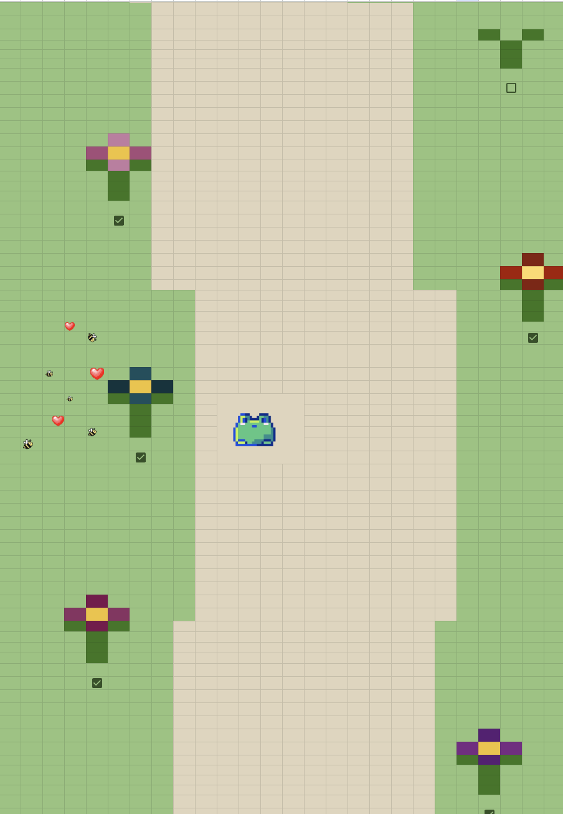
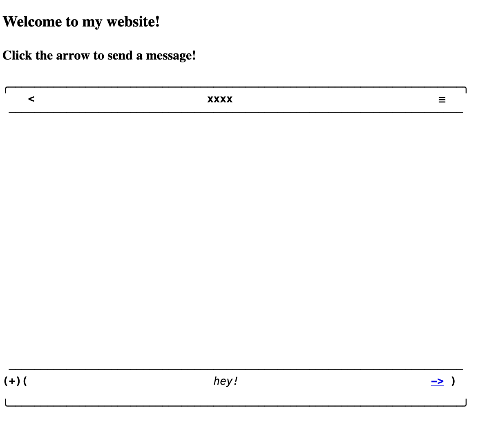
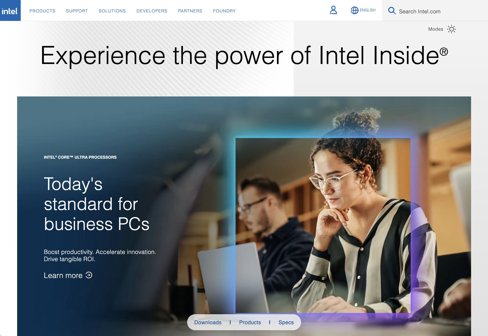

# Emma's CommLab Page

_Fall 2025 with Prof. Leon Eckert_

###### ! _view rendered site [here](https://emma-deleon.github.io/CommLab/)_ !

---

Check out my work below ↓ ↓ ↓

## Classwork

1. [My First Website](my-first-website)
2. [Week 4 In-Class](week-4-in-class)
3. [Messy CSS](tutorial-messy-css)
4. [CSS Tests](css-tests)
   - [CSS Layout 1](css-layout-1)
   - [CSS Layout 2](css-layout-2)

## Recitation Work

### 1. [A Journey Through Sheets](https://docs.google.com/spreadsheets/d/1_nVe2Vzv9B2lLLGR55wGwcTeC2Y_hEOeWUVS6tyvbAY/edit?usp=sharing)

### 2. [Life Story](life-story)

### 3. [Anatomy of Web](shanzai-web) _(Shanzai Web)_

## Projects

1. [Shanzai Web](project-1)
