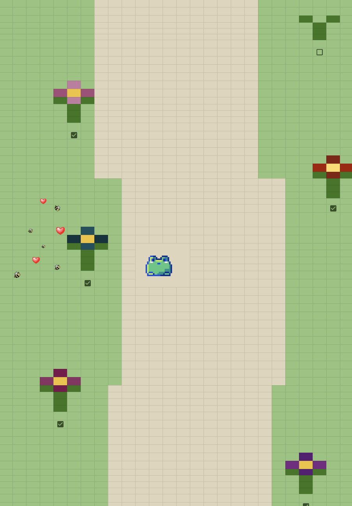

# Emma's CommLab Page

_Fall 2025 with Prof. Leon Eckert_

###### ! _view rendered site [here](https://emma-deleon.github.io/CommLab/)_ !

---

Check out my work below ↓ ↓ ↓

## Classwork

### 1. My First Website  &#124; [Live](https://emma-deleon.github.io/CommLab/my-first-website/)  ✦ [Code](my-first-website)

### 2. Week 4 In-Class  &#124; [Live](https://emma-deleon.github.io/CommLab/week-4-in-class/)  ✦ [Code](week-4-in-class)

### 3. Messy CSS  &#124; [Live](https://emma-deleon.github.io/CommLab/tutorial-messy-css/chapter-2-3.html)  ✦ [Code](tutorial-messy-css/chapter-2-3.html)

### 4. CSS Tests  &#124; [Live](https://emma-deleon.github.io/CommLab/css-tests/)  ✦ [Code](css-tests)
   - CSS Layout 1  &#124; [Live](https://emma-deleon.github.io/CommLab/css-layout-1/)  ✦ [Code](css-layout-1)

   - CSS Layout 2  &#124; [Live](https://emma-deleon.github.io/CommLab/css-layout-2/)  ✦ [Code](css-layout-2)
   
   - CSS Animations  &#124; [Live](https://emma-deleon.github.io/CommLab/css-animations/)  ✦ [Code](css-animations)

### 5. JavaScript Tests
   - Day 1  &#124; [Live](https://emma-deleon.github.io/CommLab/js1)  ✦ [Code](js1)

   - Day 2  &#124; [Live](https://emma-deleon.github.io/CommLab/js2)  ✦ [Code](js2)

   - Day 3  &#124; [Live](https://emma-deleon.github.io/CommLab/js3)  ✦ [Code](js3)

   - JavaScript Events  &#124; [Live](https://emma-deleon.github.io/CommLab/js-events)  ✦ [Code](js-events)
       - Lorem Event &#124; [Live](https://emma-deleon.github.io/CommLab/lorem-event)  ✦ [Code](lorem-event)
   - JavaScript Time Conditions  &#124; [Live](https://emma-deleon.github.io/CommLab/js-time-conditions)  ✦ [Code](js-time-conditions)

   - Web Sound &#124; [Live](https://emma-deleon.github.io/CommLab/web-sound)  ✦ [Code](web-sound)

   - Time &#124; [Live](https://emma-deleon.github.io/CommLab/js-datetime)  ✦ [Code](js-datetime)

   - Scroll &#124; [Live](https://emma-deleon.github.io/CommLab/scroll-thresholds)  ✦ [Code](scroll-thresholds)

## Recitation Work

### 1. [A Journey Through Sheets](https://docs.google.com/spreadsheets/d/1_nVe2Vzv9B2lLLGR55wGwcTeC2Y_hEOeWUVS6tyvbAY/edit?usp=sharing)

<!--  -->

### 2. Life Story  &#124; [Live](https://emma-deleon.github.io/CommLab/life-story/) ⋆˙⟡ [Code](life-story)

<!--  -->

### 3. Anatomy of Web _(Shanzai Web)_  &#124; [Live](https://emma-deleon.github.io/CommLab/shanzai-web/anatomy-of-a-website/recreation/) ⋆˙⟡ [Code](shanzai-web) 

<!--  -->

### 4. Lorem  &#124; [Live](https://emma-deleon.github.io/CommLab/lorem) ⋆˙⟡ [Code](lorem)

<!--  -->

### 5. DOM Entropy  &#124; [Live](https://emma-deleon.github.io/CommLab/dom-entropy) ⋆˙⟡ [Code](dom-entropy)

<!--  -->

### 6. JS Clock  &#124; [Live](https://emma-deleon.github.io/CommLab/clock) ⋆˙⟡ [Code](clock)

## Projects

### 1. Shanzai Web  &#124; [Live](https://emma-deleon.github.io/CommLab/project-1/) ⋆˙⟡ [Code](project-1)

<!--  -->

### 2. Final &#124; [Live](https://emma-deleon.github.io/CommLab/final-1/) ⋆˙⟡ [Code](final/main)

🚧 _under construction !_ 🚧

## Other

### Collision Test &#124; [Live](https://emma-deleon.github.io/CommLab/final/collision-test) ⋆˙⟡ [Code](final/collision-test/)

