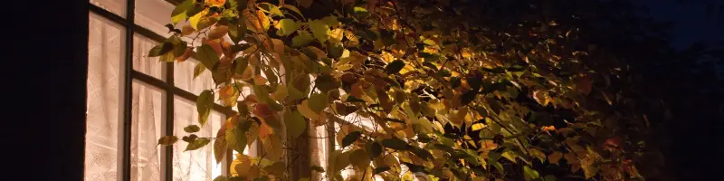
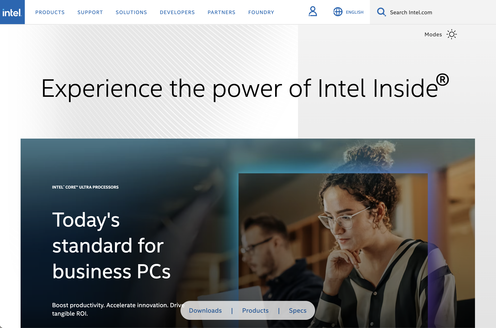
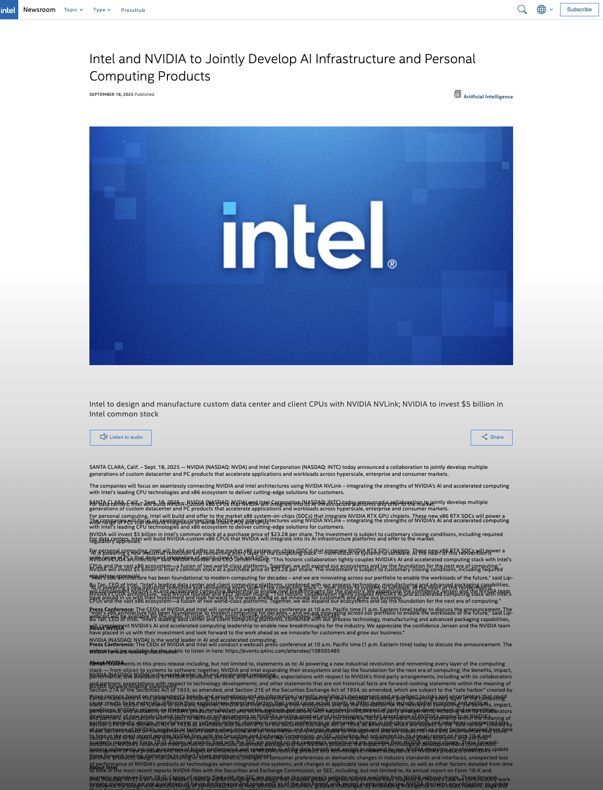
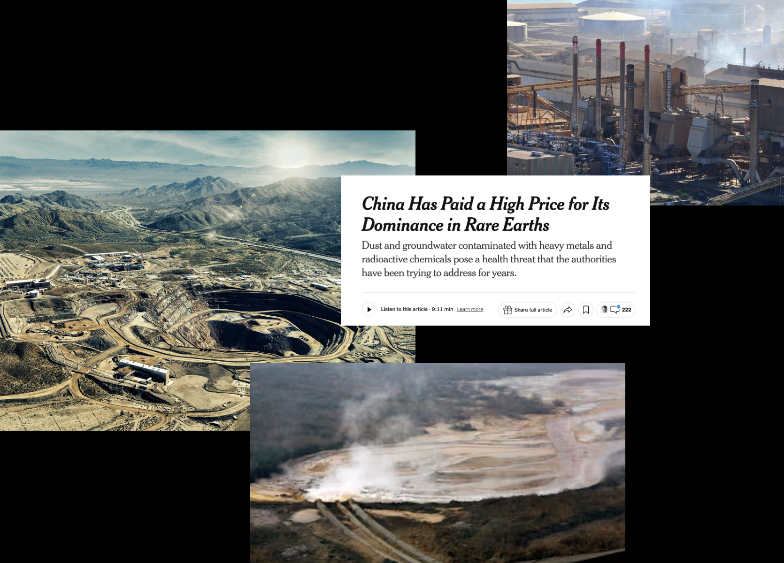

# Shanzai Web
######  Project 1 (27.10.25) 
*by Emma*

---
 

# Part A

## Intel (?)
#### A more transparent website

*On the surface, this website appears to be the official Intel site. Underneath lies the information that companies like Intel try to gloss over* 

**Abstract:**\
Many companies are becoming increasingly more AI-heavy/positive. Companies tend to display AI as a neutral technology and fail to portray the full scale of how gathering resources for their systems and maintaining them affect people and the environment. I chose to take over Intel’s website to send this message. I kept many elements of the original website the same, and change/added elements to suit my narrative. **(If you are interested in seeing my recreation of the website before I added changes, check out the [*recitation version*](../shanzai-web/anatomy-of-a-website/recreation/index.html) of this assignment).** For the aspects of my website where I added text or images, each element can be clicked to find where those sources come from. Feel free to look around and learn more about the processes behind where our technology comes from and how it is currently sustained.

---

